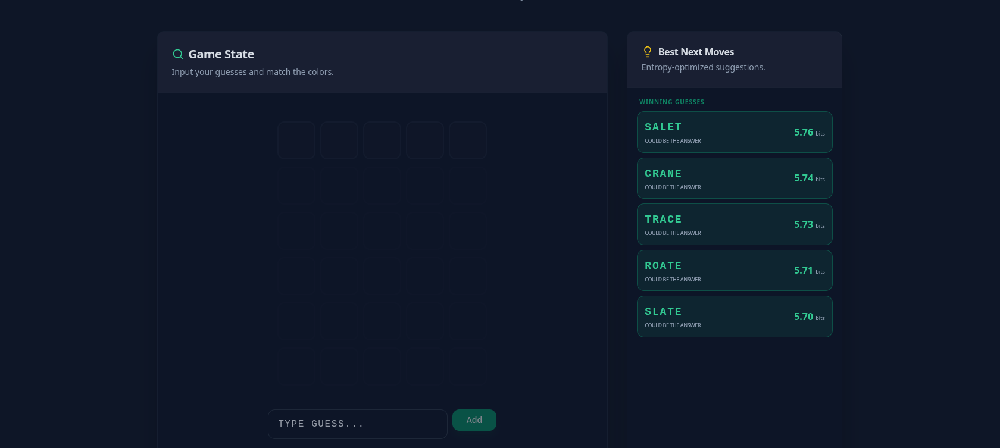
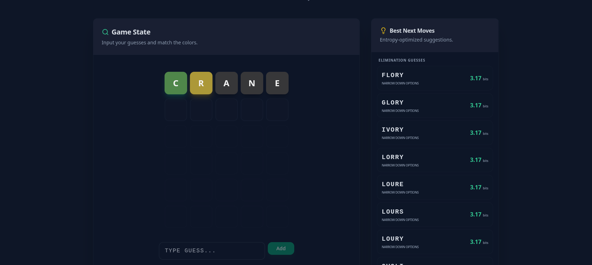

# Wordle Solver

[](https://nextjs.org/)
[](https://www.typescriptlang.org/)
[](https://tailwindcss.com/)
[](https://opensource.org/licenses/MIT)

An entropy-based Wordle assistant that calculates the optimal next guess using information theory.

---

## Features

-   **Information Theory Algorithm**: Uses Shannon entropy to identify guesses that maximize information gain.
-   **Interactive Grid**: Input guesses and toggle tile colors to match your current Wordle game.
-   **Dynamic Filtering**: Real-time solution narrowing based on provided feedback.
-   **State Management**: Support for undoing guesses and resetting the game state.

---

## Screenshots

### Dashboard
Initial view showing the optimal starting words.


### Solver in Progress
Real-time suggestions based on current feedback.


---

## Installation

### Prerequisites

-   Node.js (v18+)
-   npm

### Setup

1.  **Clone the repository**
    ```bash
    git clone https://github.com/ewoutdc/wordle-solver.git
    cd wordle-solver
    ```

2.  **Install dependencies**
    ```bash
    npm install
    ```

3.  **Run development server**
    ```bash
    npm run dev
    ```

4.  **Access the application**
    Open [http://localhost:3000](http://localhost:3000) in your browser.

---

## Technical Overview

The solver identifies the optimal guess by calculating the **Shannon Entropy** of each candidate word.

1.  **Probability Distribution**: For every word, the algorithm determines the probability of receiving each of the 243 possible feedback patterns (3^5).
2.  **Entropy Calculation**:
    $$E[I] = \sum_{p \in Patterns} P(p) \log_2\left(\frac{1}{P(p)}\right)$$
3.  **Selection**: The words are ranked by expected information gain (bits). Guesses that are potential solutions receive a slight priority when entropy values are near-identical.

---

## Tech Stack

-   **Framework**: Next.js 16 (App Router)
-   **Styling**: Tailwind CSS
-   **Components**: Radix UI, Lucide
-   **Logic**: TypeScript

---

## License

Distributed under the MIT License. See `LICENSE` for more information.
